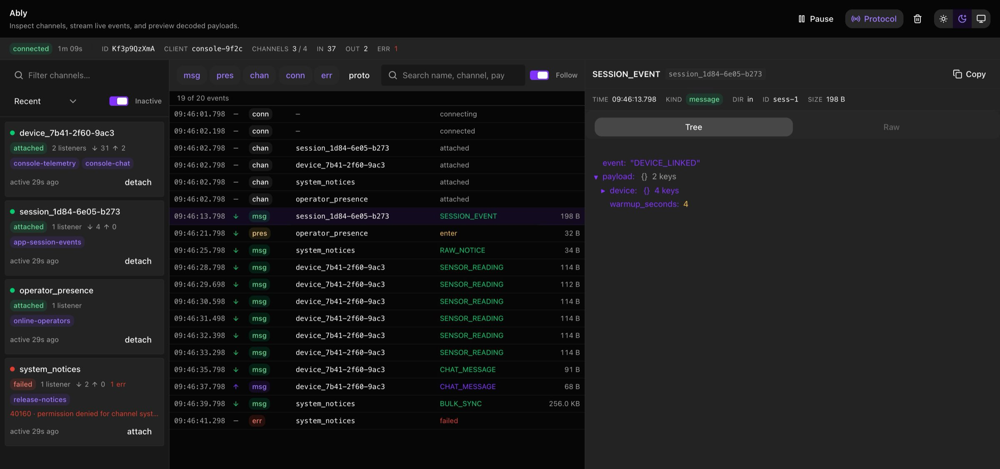

# @avasapp/rozenite-plugin-ably

An [Ably](https://ably.com) Realtime inspector for React Native DevTools, built on
[Rozenite](https://www.rozenite.dev).

The Network Activity panel already shows you websocket frames. This shows you
**Ably**: which channels are attached right now, who is subscribed to them, what
messages actually arrived, and what was inside them.



## Why

A websocket inspector answers "what bytes moved". Debugging realtime usually
means answering different questions:

- Which channels are attached *right now* — and which ones silently went
  `suspended` twenty minutes ago?
- How many subscribers does this channel have, and which feature registered them?
- Did that message actually arrive, or is the UI just not re-rendering?
- What was in the payload — as a tree, not as one escaped JSON string?

## Install

```bash
npm install --save-dev @avasapp/rozenite-plugin-ably
```

Rozenite discovers the plugin automatically. No `metro.config` change is needed
beyond having Rozenite itself set up.

## Usage

Call the hook once, anywhere in your component tree, with your `Ably.Realtime`
client:

```ts
import { useAblyDevTools } from '@avasapp/rozenite-plugin-ably'

function DevTools() {
  useAblyDevTools(ablyRealtimeClient)
  return null
}
```

It is a no-op outside `__DEV__`, and a no-op while the client is `null`, so it is
safe to call before the client exists:

```ts
useAblyDevTools(isLoggedIn ? client : null)
```

### Channel labels

Ably channel names are often opaque (`device_7b41-…`). If your app knows which
feature subscribed to what, feed that in and the panel will show it on each
channel:

```ts
useAblyDevTools(client, {
  labels: {
    getLabels: () => ({ 'device_7b41': ['telemetry-screen', 'chat'] }),
    subscribe: (onChange) => registry.onChange(onChange), // optional
  },
})
```

<details>
<summary>Example: deriving labels from a transport layer that already tracks them</summary>

```ts
useAblyDevTools(getAblyJsClient(), {
  labels: {
    getLabels: () =>
      Object.fromEntries(
        getTransport()
          .getChannels()
          .map((c) => [
            c.name,
            c.listenerDetails
              .map((l) => l.label)
              .filter((l): l is string => Boolean(l)),
          ]),
      ),
    subscribe: (onChange) => getTransport().onChannelsChange(onChange),
  },
})
```

</details>

### Options

| Option            | Default | Description                                                                   |
| ----------------- | ------- | ----------------------------------------------------------------------------- |
| `labels`          | —       | Maps channel names to human-readable labels.                                  |
| `maxEvents`       | `1000`  | Ring-buffer size. Older events are dropped once exceeded.                     |
| `captureProtocol` | `false` | Capture raw ably-js protocol frames. Verbose; also toggleable from the panel. |
| `enabled`         | `true`  | Escape hatch. The plugin is already inert outside `__DEV__`.                  |

## What you get

**Channels** — every channel the client has touched, with its live attach state,
subscriber count, per-channel in/out counters, error reason, and time in state.
Detached and released channels are retained behind a toggle, because "the channel
I expected isn't there" is the bug you most often need to see.

**Events** — a filterable stream of messages, presence, channel/connection state
transitions, and errors. Filter by kind, by channel, or by free text that
searches payload contents too.

**Payloads** — Ably delivers most payloads as a JSON *string*. The plugin parses
it and keeps the original, so you get a real collapsible tree by default and the
exact bytes on demand. Search highlights matches and auto-expands the path to
them.

## Design notes

A few decisions that are load-bearing if you plan to modify this:

- **Your listeners are never wrapped.** Message content is observed through a
  separate passive subscription, so a bug in this plugin cannot stop your app
  receiving a message.
- **No attach is ever caused that your app did not ask for.** The passive
  subscription is installed lazily, only once your app has itself subscribed to
  that channel.
- **Nothing throws into your call path.** Every patched method calls through in a
  `finally`, and all bookkeeping is guarded. A payload whose getter throws is
  still recorded — marked undecodable — rather than silently dropped.
- **Fully reversible.** Every patch stores its original and is restored on
  unmount, so hot reload does not stack wrappers.
- **No `ably` dependency.** The client is typed structurally, so this package
  works against whatever ably-js version you have and adds nothing to your
  dependency graph.

### Protocol capture

Enabling protocol capture calls `client.setLog({ level: 4 })`. That method is
present at runtime but is not in ably-js's public typings, so it is
feature-detected — if it is missing, the panel disables the toggle and says so.
It is off by default because level 4 is genuinely noisy and slows the SDK.

## Example app

`example/` is a runnable Expo app that exercises the plugin with **no Ably
account, no API key, and no login**. The Ably client is a fake that produces
realistic traffic; everything else is real — it goes through the actual
`useAblyDevTools` hook and the actual Rozenite bridge, so the panel shows
exactly what a production app produces.

```bash
bun install && bun run build   # in the repo root — the panel is served from dist/
cd example
bun install                    # symlinks the plugin (see scripts/link-plugin.mjs)
bun start                      # then press `j`, and pick the "Ably" tab
```

The app has buttons for the cases worth eyeballing: nested session events, a 25-message
burst, an outgoing publish, presence churn, a non-JSON payload, an oversized
payload that hits truncation, a channel failing with error `40160`, a full
disconnect/recover cycle, and a channel release.

Two wiring details worth knowing if you adapt this setup:

- Rozenite discovers plugins from the project's **declared `package.json`
  dependencies** — it does not crawl `node_modules`. Since the plugin lives one
  directory up, `metro.config.js` names it via `include: ['@avasapp/rozenite-plugin-ably']`.
- Metro resolves the bare specifier to the plugin's TypeScript **source**, so SDK
  edits hot reload. Panel edits still need `bun run build` in the root, because
  the panel is served from `dist/`.

## Panel UI

The panel is built on [`@rozenite/ui`](https://github.com/callstackincubator/rozenite/tree/main/packages/ui),
the shared HeroUI + Tailwind design system the official Rozenite plugins use, so
it matches the rest of the DevTools chrome and follows the DevTools light/dark
theme (including the per-panel theme switcher in the header).

Styling comes from `src/panel/globals.css`, which pulls in Tailwind and
`@rozenite/ui/styles.css`; there is no plugin-specific stylesheet. The one place
this panel deliberately does not use a shared component is the event table —
it stays a plain table so that text selection and browser find keep working on
payload text, which collection-based and virtualised tables break.

## Development

```bash
bun install
bun test        # instrumentation test suite
bun typecheck
bun run build
```

`bun dev` starts Rozenite's browser dev host on
[localhost:8888](http://localhost:8888) for quick panel iteration. Note that
`rozenite.config.ts` **cannot import anything** — Rozenite evaluates it with
`new Function('module','exports', code)` and no `require` in scope — so the dev
presets there are literal payloads. Realistic traffic lives in `example/`
instead, where it can import the real SDK.

To iterate against a real app:

```bash
bun link                                   # in this repo
cd ../your-app && bun link @avasapp/rozenite-plugin-ably
ROZENITE_DEV_MODE=@avasapp/rozenite-plugin-ably bun dev
```

## License

MIT
